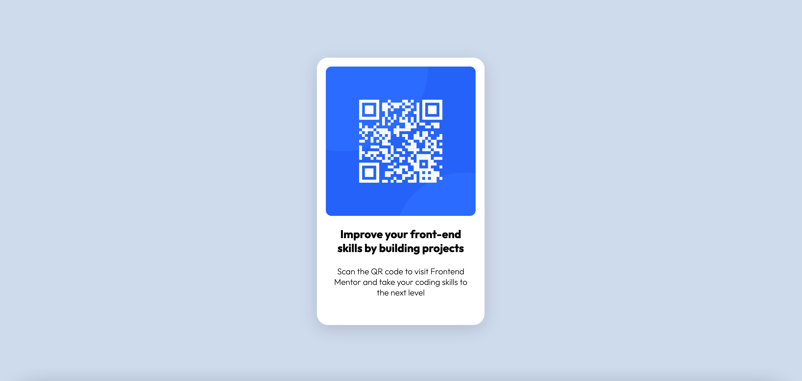

# Frontend Mentor - QR code component solution

This is a solution to the [QR code component challenge on Frontend Mentor](https://www.frontendmentor.io/challenges/qr-code-component-iux_sIO_H). Frontend Mentor challenges help you improve your coding skills by building realistic projects.

## Table of contents

- [Screenshot](#screenshot)
- [Links](#links)
- [Built with](#built-with)

### Screenshot

### Links

- Solution URL: [https://github.com/kateneilsen/qr-code-component](https://github.com/kateneilsen/qr-code-component)
- Live Site URL: [https://qr-code-component-one-snowy.vercel.app](https://qr-code-component-one-snowy.vercel.app)

## My process

### Built with

- HTML
- CSS
- Flexbox
- Mobile-first workflow
